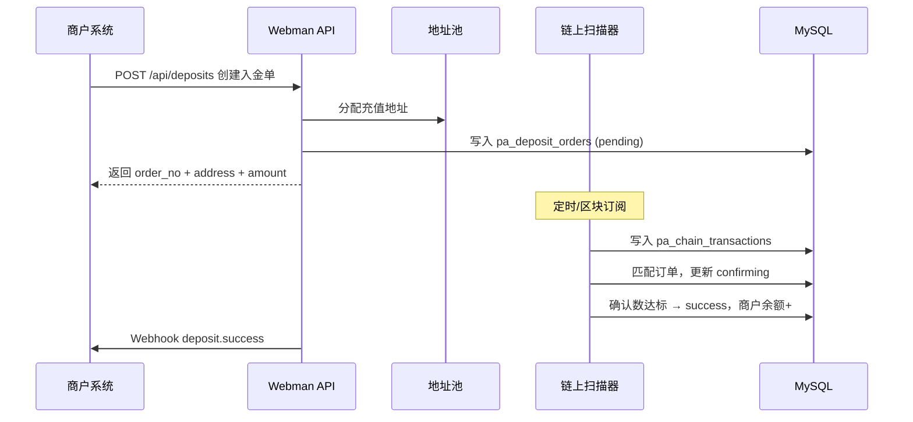
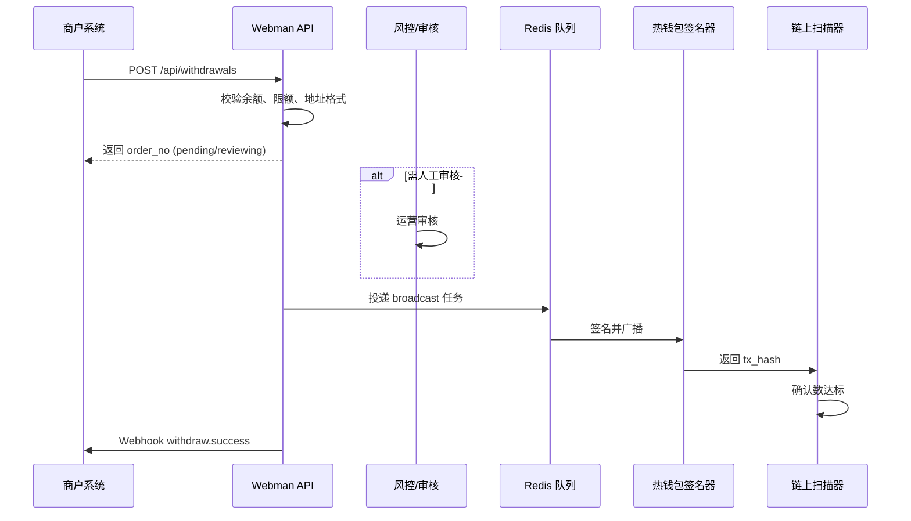

# 产品需求文档（PRD）— USDT 充付系统

**Version**：V1.0  
**Date**：2026-08-19  
**Status**：Draft  
**适用范围**：Webman 管理后台 + 商户 Open API

---

## 1. 产品概述

### 1.1 背景

构建一套 **USDT 入金（充 U）与出金/代付（付 U）** 能力，供内部运营或其它业务系统通过 API 接入。平台负责：

- 生成/分配充值地址并监听链上到账  
- 审核与执行出金，从热钱包广播交易  
- 对商户账户记账、对账、回调通知  

### 1.2 目标

| 目标 | 说明 |
|------|------|
| 多链支持 | 首期 **TRC20-USDT**；架构预留 BEP20 / ERC20 |
| 可运营 | 管理端可查单、补单、审核、配置限额与费率 |
| 可集成 | 商户 API：创建订单、查询状态、接收 Webhook |
| 可审计 | 订单、链上交易、人工操作、回调全链路留痕 |
| 高一致 | 金额用 `DECIMAL`；状态机严格；幂等键防重复 |

### 1.3 非目标（V1 不做）

- 法币 OTC、银行卡代收付  
- 链上 DEX 兑换  
- 多租户 SaaS 计费（V1 单库单部署，商户为逻辑隔离）  
- 用户端 H5 钱包（除非二期明确要求）

---

## 2. 角色与权限

### 2.1 角色

| 角色 | 说明 | 使用端 |
|------|------|--------|
| 超级管理员 | 全部权限，含密钥类配置 | 管理后台 |
| 运营 | 查单、补单、审核出金、商户管理 | 管理后台 |
| 财务 | 对账、导出、只读 + 审核 | 管理后台 |
| 商户系统 | API Key 调用，接收回调 | Open API |

### 2.2 管理端权限粒度（RBAC slug 示例）

```
pay:merchant:*          商户 CRUD、重置密钥
pay:deposit:*           入金订单列表、详情、补单、导出
pay:withdraw:*          出金订单列表、审核、驳回、导出
pay:platform:*          通道配置
pay:wallet:*            地址池、热钱包余额查看
pay:collection:*        归集任务
pay:webhook:*           回调日志、手动重试
pay:report:*            对账报表
```

敏感操作（修改热钱包配置、手动补单、大额审核通过）需 **谷歌验证码**（复用现有 `RequiresGoogleAuth`）。

---

## 3. 核心业务流

### 3.1 充 U（入金）



**规则要点**：

- 每单绑定唯一 `order_no`（商户侧 `out_trade_no` 幂等）  
- 充值地址：推荐 **HD 派生地址**（一单一址），降低串单风险  
- 到账金额允许 **±dust 容差** 或 **必须精确匹配**（通道级配置）  
- 超时未付：`pending` → `expired`（可配置 TTL，默认 30 分钟）  
- 少付/多付：可配置策略（拒绝入账 / 按实际入账 / 人工补单）

### 3.2 付 U（出金/代付）



**规则要点**：

- 出金前 **冻结** 商户可用余额（`available` → `frozen`）  
- 审核策略：金额阈值、新地址、黑名单、商户等级  
- 手续费：内扣（到账 = 申请 - fee）或外扣（另扣商户余额）  
- 广播失败：自动重试 N 次 → `failed`，解冻余额  
- 链上成功但回调失败：异步重试 Webhook（指数退避）

### 3.3 归集（可选，V1.1）

将充值子地址 USDT 归集至热钱包，降低出金时地址分散导致的 Gas/能量不足问题（TRON 需能量）。

---

## 4. 订单状态机

### 4.1 入金订单 `pa_deposit_orders.status`

| 状态 | 说明 |
|------|------|
| `pending` | 已创建，等待链上转账 |
| `detecting` | 已检测到 tx，未达确认数 |
| `confirming` | 确认中（可选，与 detecting 合并） |
| `success` | 入账完成 |
| `expired` | 超时未付 |
| `failed` | 失败（如金额不符且策略为拒绝） |
| `manual` | 待人工补单处理 |

合法流转：

```
pending → detecting → success
pending → expired
detecting → failed
pending/detecting → manual → success|failed
```

### 4.2 出金订单 `pa_withdraw_orders.status`

| 状态 | 说明 |
|------|------|
| `pending` | 已受理 |
| `reviewing` | 待审核 |
| `approved` | 审核通过，待广播 |
| `paying` | 已广播，待确认 |
| `success` | 链上确认完成 |
| `rejected` | 审核驳回 |
| `failed` | 广播或链上失败 |
| `cancelled` | 商户或管理员取消 |

```
pending → reviewing → approved → paying → success
pending → rejected
approved → failed (解冻)
reviewing → cancelled
```

---

## 5. 功能清单

### 5.1 管理后台

| 模块 | 功能 |
|------|------|
| 商户管理 | 创建商户、API Key/Secret、IP 白名单、费率、限额、启停 |
| 通道管理 | TRC20/BEP20 配置：合约地址、确认数、最小/最大金额、超时 |
| 入金订单 | 列表筛选、详情、链上 tx、补单、导出 |
| 出金订单 | 列表、审核/驳回、重试广播、导出 |
| 钱包管理 | 地址池、热钱包监控、余额告警 |
| 归集管理 | 任务列表、手动触发 |
| 回调日志 | Webhook 记录、重发 |
| 对账报表 | 日/商户维度：入金、出金、手续费、净额 |
| 系统参数 | 全局开关、默认确认数、告警阈值 |

### 5.2 商户 Open API

| 能力 | 说明 |
|------|------|
| 创建入金单 | 返回收款地址与金额 |
| 查询入金单 | 按 `order_no` 或 `out_trade_no` |
| 创建出金单 | 提交目标地址与金额 |
| 查询出金单 | 状态与 tx_hash |
| 查询余额 | 可用/冻结 |
| Webhook | 订单终态及关键中间态通知 |

---

## 6. 风控与合规

| 项 | 策略 |
|----|------|
| 地址黑名单 | 链上/内部黑名单表，出金拦截 |
| 单笔/日累计限额 | 商户级 + 通道级 |
| 重复 tx | `tx_hash + chain` 唯一，防双花入账 |
| API 签名 | HMAC-SHA256，timestamp 防重放（±300s） |
| 私钥 | 不落库明文；环境变量或 KMS；签名服务独立进程 |
| 审计 | 人工补单、审核、改配置写 `sy_admin_logs` |

---

## 7. 验收标准（V1）

- [ ] TRC20 入金：创建订单 → 链上转账 → 自动 success → 商户回调  
- [ ] TRC20 出金：创建 → 审核（可配置自动）→ 广播 → success → 回调  
- [ ] 幂等：`out_trade_no` 重复请求返回同一订单  
- [ ] 管理端：订单可查、可导出、权限可控  
- [ ] 异常：广播失败解冻；回调失败可重试  
- [ ] 金额：全程 DECIMAL，无 float 运算  

---

## 8. 附录：与历史字段映射

项目 `config/field_renames.php` 中曾出现 `pa_recharge_order` / `pa_withdraw_order` / `pa_platform`，本 PRD 统一命名为：

| 旧名 | 新名 |
|------|------|
| `pa_recharge_order` | `pa_deposit_orders` |
| `pa_withdraw_order` | `pa_withdraw_orders` |
| `pa_platform` | `pa_platforms` |

字段语义见 [数据库设计.md](./数据库设计.md)。
