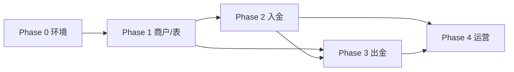

# 开发计划 — USDT 充付系统

**Version**：V1.0  
**Date**：2026-08-19  
**预估周期**：4–6 周（1 后端 + 1 前端，视链上环境而定）

---

## 1. 分期交付

### Phase 0 — 基础准备（2–3 天）

| 任务 | 产出 |
|------|------|
| 确认 TRON 节点（TronGrid / 自建） | 节点 URL、API Key |
| 准备测试 USDT / TRX | 测试网或小额主网 |
| 配置 `.env` 链上相关变量 | 见下文 |
| 扩展 `ErrorCode` 43xxx | 业务错误码 |
| 新增 `app/support/Decimal.php` | 金额工具 |

### Phase 1 — 数据层与商户（3–4 天）

| 任务 | 产出 |
|------|------|
| 创建 `app/model/pay/*` 全部 Model + tableSchema | 表结构同步 |
| MerchantService + CRUD | 管理端商户 API |
| PlatformService + 种子数据 TRC20_USDT | 默认通道 |
| LedgerService 账务记账 | 流水 + 余额更新 |
| 管理前端：商户列表/表单 | `views/Pay/Merchant` |

**验收**：可创建商户，查询账户余额为 0。

### Phase 2 — 充 U 入金（5–7 天）

| 任务 | 产出 |
|------|------|
| WalletService HD 派生地址 | 地址池 |
| TronAdapter 实现 | 查余额、查 TRC20 转账 |
| DepositOrderService 创建/查询 | 商户 API + 幂等 |
| ChainScanner 进程/Command | 扫描入账 |
| ConfirmChecker | 确认数达标 → success |
| OrderExpireTimer | 过期处理 |
| WebhookService 入金回调 | 队列重试 |
| 管理端入金列表/详情/补单 | 前端 + 导出 |

**验收**：测试网/主网小额入金全自动到账并回调。

### Phase 3 — 付 U 出金（5–7 天）

| 任务 | 产出 |
|------|------|
| WithdrawOrderService | 创建、冻结、状态机 |
| RiskService | 限额、黑名单 |
| 审核流（人工 + auto_withdraw_max） | 管理端审核按钮 |
| WithdrawBroadcastConsumer | 签名广播 |
| 出金确认扫描 | tx 确认 → success |
| Webhook 出金事件 | |
| 管理端出金列表/审核 | 前端 |

**验收**：出金全流程含驳回解冻、广播失败重试。

### Phase 4 — 运营增强（3–5 天）

| 任务 | 产出 |
|------|------|
| 热钱包余额监控告警 | NotificationService |
| 回调日志 + 手动重试 | 管理页 |
| 日报表 API | 简单汇总 |
| 归集任务（可选 V1.1） | CollectionConsumer |
| API 集成测试 | tests/Api/Pay/* |
| 文档与 Postman 集合 | doc + scripts |

---

## 2. 任务依赖图



---

## 3. 环境变量

在 `.env.example` 中追加：

```ini
# ---------- USDT 充付 ----------
PAY_ORDER_SEQ_REDIS=default

# TRON
TRON_NETWORK=mainnet
TRON_API_URL=https://api.trongrid.io
TRON_API_KEY=
TRON_USDT_CONTRACT=TR7NHqjeKQxGTCi8q8ZY4pL8otSzgjLj6t
TRON_DEPOSIT_CONFIRMATIONS=19
TRON_WITHDRAW_CONFIRMATIONS=19

# HD 钱包（仅示例，生产用 KMS）
TRON_HD_MNEMONIC=
TRON_HD_PASSPHRASE=
TRON_HOT_WALLET_ADDRESS=
TRON_HOT_WALLET_PRIVATE_KEY_ENCRYPTED=

# 出金
PAY_WITHDRAW_AUTO_MAX=1000
PAY_WEBHOOK_MAX_RETRY=5
```

> 修改 `.env` 后须重启 Webman。

---

## 4. 路由注册顺序

1. `config/routes/api.php` — 商户 `/api/pay/*`  
2. `config/routes/admin.php` — 管理 `/admin/pay/*`  
3. `php webman menu --fresh`  

---

## 5. 队列注册

`config/plugin/webman/redis-queue/process.php` 追加：

```php
'pay_withdraw' => [
    'handler' => RedisQueueConsumer::class,
    'count' => 2,
    'constructor' => [
        app_path() . '/queue/redis',
        ['pay_withdraw_broadcast', 'pay_webhook'],
    ],
],
```

---

## 6. 前端页面清单

| 路由 | 组件 | 优先级 |
|------|------|--------|
| /pay/merchant | views/pay/merchant/index | P1 |
| /pay/platform | views/pay/platform/index | P1 |
| /pay/deposit | views/pay/deposit/index | P2 |
| /pay/withdraw | views/pay/withdraw/index | P3 |
| /pay/wallet | views/pay/wallet/index | P4 |
| /pay/webhook-log | views/pay/webhook-log/index | P4 |
| /pay/report | views/pay/report/index | P4 |

组件风格对齐现有 `views/System/*`：ContentWrap + Table + 搜索表单 + 权限指令。

---

## 7. 测试计划

| 场景 | 类型 |
|------|------|
| 商户签名验证 | Unit |
| 入金幂等 | Api |
| 金额边界 min/max | Api |
| 余额不足出金 | Api |
| 状态非法流转 | Unit |
| 人工补单权限 | Api + 手动 |

链上相关集成测试可用 **Nile 测试网** 或 Mock `ChainAdapterInterface`。

---

## 8. 上线清单

- [ ] `APP_DEBUG=false`  
- [ ] 商户 API 强制 HTTPS  
- [ ] 热钱包私钥加密存储，权限最小化  
- [ ] Tron 节点 SLA / 备用节点  
- [ ] Redis / MySQL 备份策略  
- [ ] 监控：队列堆积、扫描延迟、热钱包余额  
- [ ] 告警：Telegram / 邮件（复用 NotificationService）  
- [ ] 运营手册：补单、驳回、重播回调  
- [ ] 限额与黑名单初始配置  

---

## 9. 风险与缓解

| 风险 | 缓解 |
|------|------|
| 链上节点不稳定 | 双节点 + 扫描退避重试 |
| TRON 能量不足 | 监控 + 自动 TRX 补充 / 能量租赁 |
| 串单/重复入账 | tx_hash 唯一 + 一单一址 |
| 私钥泄露 | 独立 Signer、KMS、冷钱包 |
| 回调丢失 | 持久化 + 指数重试 + 运营重发 |

---

## 10. 下一步行动

文档评审通过后，建议从 **Phase 1** 开始：

1. 创建 `MerchantModel`、`PlatformModel` 及 Seeder  
2. 实现 `MerchantController` + 管理端页面  
3. 恢复 `config/routes/api.php` 骨架并接入 `MerchantAuthMiddleware`  

如需直接进入编码阶段，可指定优先 **入金** 或 **出金** 一侧。
